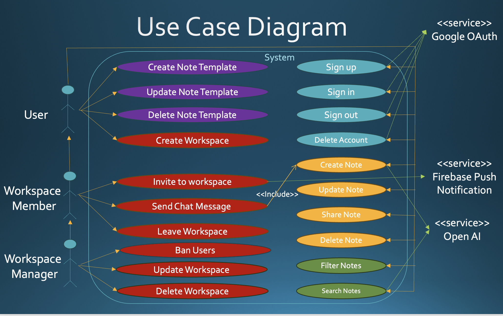
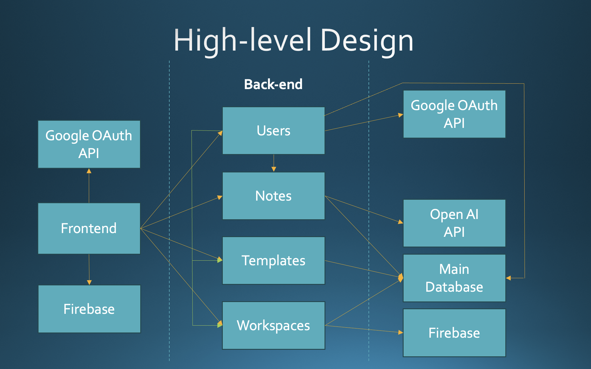
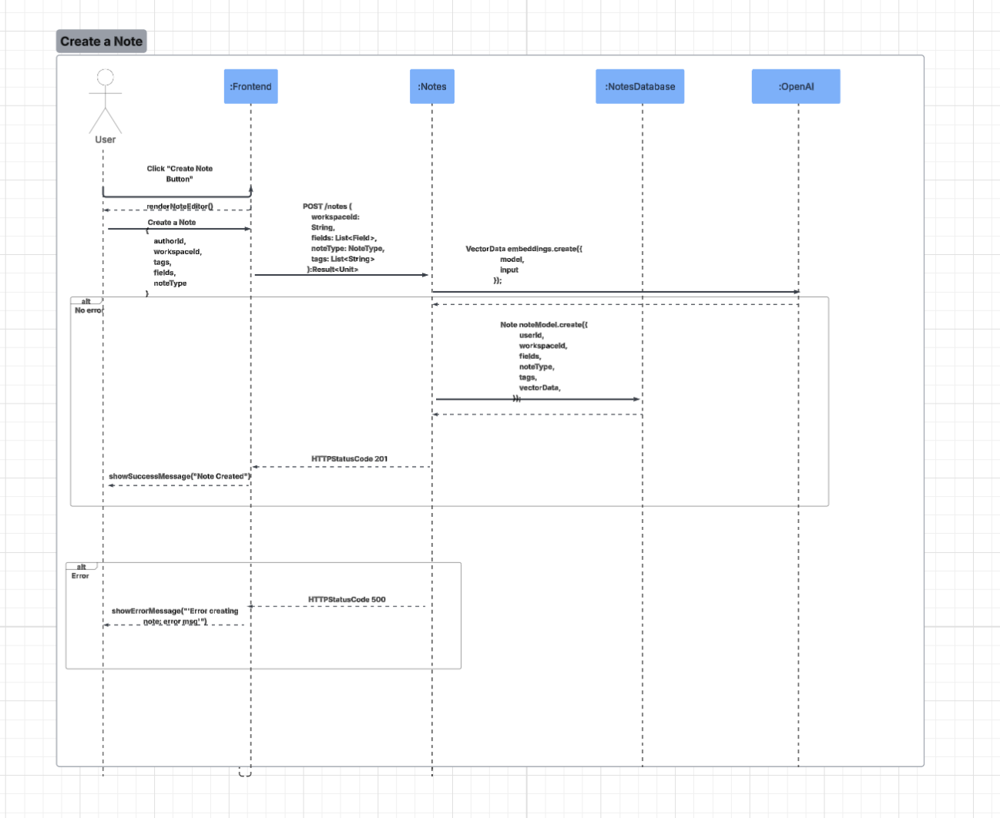
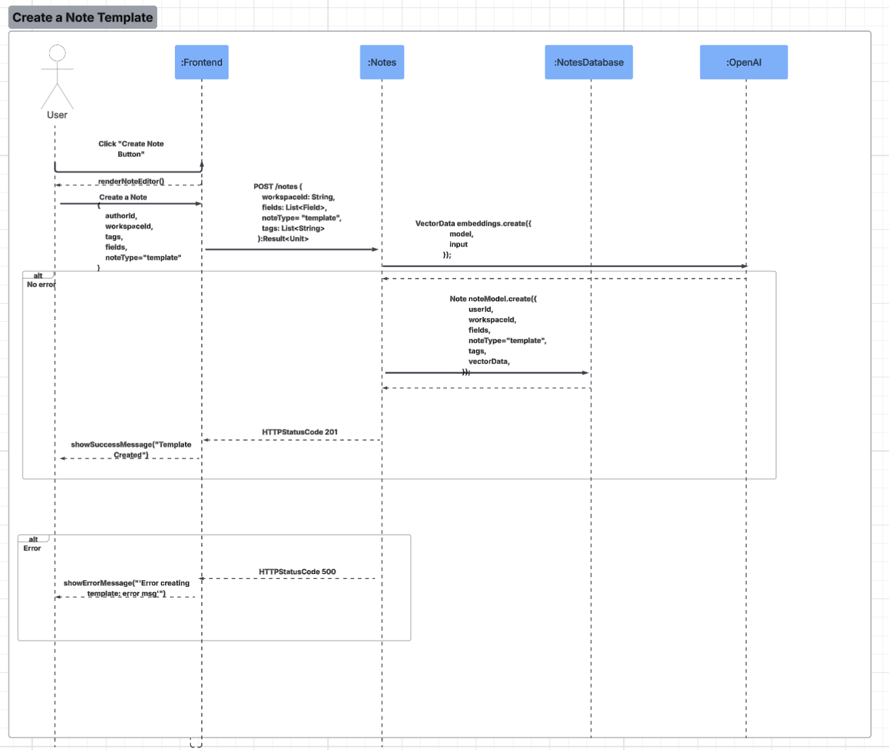
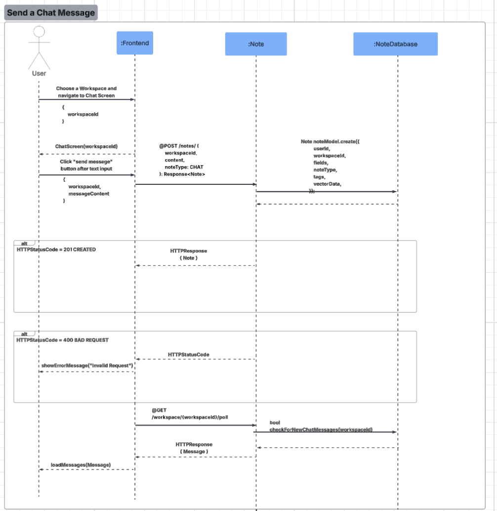

# Requirements and Design

## 1. Change History

| **Change Date**   | **Modified Sections** | **Rationale** |
| ----------------- | --------------------- | ------------- |
| 01.10.2025 | 3.3, 4.2, 4.3 | Removed all speech-to-text references. Made the Vector DB non-optional. This is because the documentation has to be consistent and optional features are not a valid basis for requirements |
| 14.10.2025 | 3.3, 4.2, 4.3 | Vector Database has been removed, we will maintain only one database. This is because an entire database dedicated to vectors is unnecessary and overly complicated for the scope and scale of our project |
| 14.10.2025 | 3.3, 4.2, 4.3 | Templates will work by created a template note and copying the note over to other workspaces. This was done to simplify implementation and for clarity |
| 20.10.2025 | 3.3, 4.2, 4.3 | Adding a user to a workspace will now send a push notification. Chat messages will no longer send a push notification|
| 24.10.2025 | 4.1 | Removed Template as a backend component since it's no longer a component. Added component interfaces |
| 25.10.2025 | 4.4 | Add more frameworks and libraries used during implementation |
| 25.10.2025 | All | Cleaned up doc and implemented feedback from M2 |
| 26.10.2025 | 4.6 | Added sequence diagrams for components |
---

## 2. Project Description

In short, we are aiming to create an application that would allow
users to store all their (non-sensitive) information in one place and in a way that is easy to update, access and search. The app itself would not incorporate dedicated features such as notes, todo-lists etc. Instead one would be able to store information in a general note, which would be composed of numerous input fields: text, datetime etc. Users will be able to create templates for their own formats of notes and join workspaces where they can share their notes with other users.
The target audience is the general public. If one has a large amount of different kinds of notes, todos or saved locations, they can use this app as a "general memory system" providing them one place to retrieve and update their entire collection of notes. However, we are especially aiming for groups of people who want to collaborate on their goal and manage this collaboration in one place and in a very customised manner. Existing apps do not fully provide such functionality (Notion: missing todos/notifications/chat, WhatsApp: files stored on everyone's machines, not able to see history prior to joining the communities, Discord: file sharing limit, Facebook: membership limits)

## 3. Requirements Specification

### **3.1. List of Features**
1. **[Manage Notes]**: A user can create, update, read and delete their own notes as well as share it with other users and workspaces they are in.
2. **[Retrieve Notes]**: A user can search through their notes and filter through the notes they see by their tags and creation/last edit dates. The searching will be synonymic, which means cases when the user does not type exactly the content of the note would be handled and the note will still be displayed.
3. **[Collaborate]**: A User can create workspaces in which case they become their managers. Inside a workspace, notes can be posted regularly or with a “chat” option. The owner is able to invite people to the workspace by an email address, and a push notification will be sent to those invited notifying them. Notes in the workspace are visible to all Users who accepted the invitation. Naturally, the manager can update their workspace, or even delete it, as well as ban certain users.
4. **[Customize Format]**: Users would be able create and manage their own formats of notes, known as templates. These can include any combination of text, location and date fields, with the condition of at least one field. They are then able to copy these templates into workspaces to be used as a normal note.

### **3.2. Use Case Diagram**

### **3.3. Actors Description**
1. **[User]**: The general user of the application. Can fully manage (CRUD + search + template creation)their own notes. Can join and create workspaces.
2. **[Workspace Member]** - can contribute to workspaces they are in by sending notes and chat messages, as well as inviting new members.
3. **[Workspace Manager]**: Inherits from User. Has additional options to update and delete the workspaces they own. Can also ban users from their workspace(s).
4. **[Google OAuth API]**: External service used  for authentication.
5. **[Open AI API]**: The role of the API would be to create vector embeddings for notes and search queries so that vector-based search algorithms, such as KNN, can be used. This is to enhance the search quality so that the user does not have to exactly match the text of the note in their prompt.
5. **[Firebase Push Notification Service]**: Firebase handles the logic for sending push notifications. 

### **3.4. Use Case Description**
- Use cases for feature 1: Manage Notes
1. **Create Note**: The user can create notes by filling in a chosen note template, adding or removing fields if necessary. They can then store this note in a chosen workspace.
2. **Update Note**: Users can update their notes and change the title, description, and other data. 
3. **Share Note**: Users can share their note to a selected workspace.
4. **Delete Note**: Users can delete their selected note.

- Use cases for feature 2: Retrieve Notes
5. **Search Notes**: A user can search for notes matching a given prompt, and is provided with a list of notes.
6. **Filter Notes**: After retrieving search results, a user can filter the results by certain tags and creation/last edit dates. 

- Use cases for feature 3: Collaborate
7. **Create Workspace**: A user can create a workspace and become the manager of it.
8. **Join Workspace**: A user can join the workspace they are invited to or reject the invitation
9. **Invite to Workspace**: Any user that is part of a workspace can invite other users to the workspace. The invited user will be sent a push notification.
10. **Send a Chat Message**: A user can send chat messages to other users or the workspaces that they are part of. A chat message is a new note that is sent to the users involved.
11. **Update Workspace**: The workspace manager can update workspace metadata, like title, descriptions, etc. 
12. **Leave Workspace**: A user can leave any workspace that they are part of.
13. **Delete Workspace**: The workspace manager can delete the workspace and all associated data
14. **Ban users**: The workspace owner can ban a user, kicking them out and preventing them from joining in the future. 

- Use cases for feature 4: Customize Format
15. **Create Template**: A user can create a note template, consisting of components like title, tags, description(s), and custom fields like "Due date" for a note template. A note template can be created from an existing note or directly.
16. **Update Template**: A user can update their templates, editing the components. 
17. **Delete Template**: A user can delete their templates, and will not be able to use it for future notes. 

...

### **3.5. Formal Use Case Specifications (5 Most Major Use Cases)**

<!-- NOTES: 5 most major use cases
- Create note
- Search notes
- Create note template
- Create workspace
- Send chat message 

#### Use Case 1: [Create a Note]

**Description**: App user is logged in and creates notes by filling the default empty template, adding or removing fields if necessary. When the note is created, it is automatically stored in the workspace the user clicked the create note button on.

**Primary actor(s)**: User
   
**Main success scenario**:
1. User clicks the “Create Note” button
2. System displays a default empty template (a text field plus tags)
3. User inputs all details of the note into the fields
4. User can add additional fields or remove fields.
5. User clicks “Create” button
6. The system creates the note with the filled in data and stores it in the database, and displays a confirmation message.

**Failure scenario(s)**:
- 5a. User did not create any fields
    - 5a1. System displays a warning message prompting the user to at least create one field
- 6a. The note could not be created
    - 6a1. System displays error message stating that the note could not be created as well as the reason for the failure (e.g. connection lost)

#### Use Case 2: [Search Notes]

**Description**: The user searches for a note that matches their inputted prompt, returning a list of matching notes

**Primary actor(s)**: User, OpenAI API
   
**Main success scenario**:
1. User clicks the “Search for a Note” button
2. System displays a text input field 
3. User types in their query and clicks the “Search” button
4. System sends query string to OpenAI API, which returns the vectorized query 
5. System displays a list of notes, sorted by how much they match the query.

**Failure scenario(s)**:
- 4a. No matching notes
	- 4a1. System simply does not display any notes
- 4b. Available notes not fetched
	- 4b1. System displays an error message stating the error code and reason the fetch failed, such as connection loss. 

#### Use Case 3: [Create A Note Template]

**Description**: The user creates a note template by adding and deleting components to their desire (e.g. text field, date field, number field).

**Primary actor(s)**: User
   
**Main success scenario**:
1. User clicks the “Create Note Template” button
2. System displays a default note template, along with buttons to create new fields or delete fields
3. User customizes the note template to their desire by adding/removing/setting default values/moving the input fields around the space available. The tag field is not removable and there must be at least one content field in the template, else the user cannot remove fields.
4. User clicks the “Create” confirmation button
5. System saves the note template and displays a confirmation message

**Failure scenario(s)**:
- 5a. Creation of note template failed (server-side)
    - 5a1. System displays error message stating the reason and tells the user to retry
- 5b. Creation of note template failed (user-error)
    - 5b1. System displays error message, pointing to areas in the template that the user may need to fix

#### Use Case 4: [Create Workspace]

**Description**: User creates a workspace, effectively becoming the workspace manager

**Primary actor(s)**: User
   
**Main success scenario**:
1. User clicks the “Create Workspace” button
2. System displays input fields needed to create a new workspace (e.g. name and description)
3. User fills in the required field: name and description
4. A create button becomes available to the user
5. User clicks the “Create” confirmation button
6. System receives the input and creates the corresponding workspace with the user being the workspace manager
7. System displays the newly created workspace to the user

**Failure scenario(s)**:
- 3a. Workspace name entered by the user is already taken by another workspace
    - 3a1. System refuses to create the workspace (no page update)

#### Use Case 5: [Send a Chat Message]

**Description**: User sends a chat message in the workspace’s chat forum.

**Primary actor(s)**: Workspace Member
   
**Main success scenario**:
1. Workspace Member navigates into any of the workspaces they are in
2. System displays the workspace
3. Workspace Member clicks the “Chat” button
4. System displays the "Chat" screen
5. Workspace Member inputs text and clicks the send button
6. System receives the input and displays it on the screen of every user in the workspace

**Failure scenario(s)**:
- 5a. The message couldn’t be sent
    - 5a1. System displays error message indicating the error code and reason
    - 5a2. User tries to send the message again after fixing the error (ex. connection error)

### **3.6. Screen Mock-ups**

### **3.7. Non-Functional Requirements**

<!-- **[Template Compatibility]**
    - **Description**: Any note template shall include a field for tags, and 1 to 39 other components (distinct input fields, i.e. a text field, or a datetime). All combinations that satisfy these quotas must be a valid template from which custom note creation forms can be automatically generated. Users should be physically unable to create templates that violate the quotas.
    - **Justification**: Versatility is the main selling point for this app. Thus, it has to be ensured that the users can shape their templates to their liking, and the templates will result in usable note creation forms, that do not experience visibly more errors than smaller forms. This will be a demanding requirement with respect to verification and might require exploratory testing on several large templates. Yet it is necessary to ensure the advertised customizability of the product.
    On the other hand, there are hard constraints on what can be customised not to disturb app functionality - there must be at least one field, such that the notes contain content and can be searched. There also must be option to edit the note's tagging, although a default tag for "not assigned" notes should be allowed. Mandatory tagging is to facilitate the filtering functionality.
    The upper limit on the number of components stems from the need to create forms for note creation. The size of form entry for one component has been estimated as 1/10th of a mobile screen. Then, we can have several tabs, but the buttons to switch between them should remain large enough to be comfortable. We have arbitrarily selected 4 tabs, which leads to 40 components (but that incudes the tagging). The 1/10th comes from comparison with Samsung Notes, which in their default font/zoom settings allow for 21 lines per page. We assumed that a form entry for each component would take a vertical space equivalent to 2 lines of default Samsung Notes text and rounded the result down.
    Now this does not impair users from putting a larger amounts of data into the notes, as the text fields can be expanded similar to e.g. sections in VS Code. -->

1. **[Feature Accessibility]**
   - **[Description]**: Any workspace of conversation the user is a member of has to be accessible to the user within two clicks from the main screen.
   - **Justification**: Several messaging/file sharing applications, such as Discord, have every conversation reachable with maximum of 2 clicks (Discord server - specific channel, or discord dms - particular chat; WhatsApp community - particular chat). The app will be feature-rich, however it should still be competitive wrt. usability.

2. **[Searching Speed]**
   - **Description**: Producing a page of synonymic search result should last no longer than 5 seconds
   - **Justification**: Synonymic searching includes calling an API to check for synonyms. While this process can take time and fitting below a second of response time is unlikely (at least not guaranteeable before actual tests with the API), we should not get close to the 10 seconds response limit mentioned in https://www.nngroup.com/articles/response-times-3-important-limits/
   The 10 seconds is the user attention limit, i.e. the time the user is said to be willing to wait without attempting to focus on other tasks. As we envision synonymic search being used frequently, getting close to this limit on regular basis would mean straining the user attention, hence we impose a safety factor of 2.
   One might point out that while the note database gets larger, there is more notes to search and more matches, hence the response time shall increase. This is why the requirement only concerns itself with one page of search results. While the note base increases, we would get more direct matches, and the first page could get populated with those ones while the app is looking for less direct matches in the background.

3. **[Filtering Speed]**
   - **Description**: Updating the display with a page of filtering (by tag or creation/last edit) results should take no longer than 1 second.
   - **Justification**: This is so that the user is not significantly disturbed by waiting for the response, as mentioned in https://www.nngroup.com/articles/response-times-3-important-limits/
   Again, while with increasing number of notes, the response time shall increase as well, filtering done by this app is an O(n) operation, and does not disturb the sorting of the data. More importantly, only a part of results that fit the filter have to be created. This is again, because the requirement only concerns itself with one page of results at a time, which is what the user will see.

## 4. Designs Specification

### **4.1. Main Components**

1. **Users**
    - **Purpose**: Manages all functionality relating to users, including creation, tracking metadata, etc. Users are a good component as each user must store some of their own data.
    - **Interfaces**:
        1. **signIn** - `POST /auth/signin (idToken: String): Result<AuthData>`
            - **Purpose**: Authenticates an existing user with Google OAuth and returns authentication data including JWT token and user information. This interface is used to log in users who already have an account in the system.

        2. **signUp** - `POST /auth/signup (idToken: String): Result<AuthData>`
            - **Purpose**: Creates a new user account using Google OAuth credentials and returns authentication data with JWT token and user information. Also automatically creates a personal workspace for the new user. This interface handles the initial registration flow for new users.

        3. **getProfile** - `GET /user/profile: Result<User>`
            - **Purpose**: Retrieves the authenticated user's profile information including name, bio, profile picture, and metadata. This interface allows users to access their own profile data.

        4. **updateProfile** - `PUT /user/profile (name: String, bio: String?): Result<User>`
            - **Purpose**: Updates the authenticated user's profile information such as name and bio. This interface allows users to modify their personal information.

        5. **deleteProfile** - `DELETE /user/profile: Result<Unit>`
            - **Purpose**: Permanently deletes the authenticated user's account and all associated data, including user images. This interface handles account deletion requests and cleanup.

        6. **updateFcmToken** - `POST /user/fcm-token (fcmToken: String): Result<User>`
            - **Purpose**: Updates the user's Firebase Cloud Messaging token for push notification delivery. This interface is called when the app receives a new FCM token.

        7. **UserModel.findById(userId: ObjectId): User**
            - **Purpose**: Exposes user retrieval by ID. Called by WorkspaceService.inviteMember() and getWorkspaceMembers() to retrieve user information for displaying members and sending notifications.

        8. **UserModel.findByIds(userIds: List<ObjectId>): List<User>**
            - **Purpose**: Exposes user retrieval for multiple IDs. Called by WorkspaceService.getWorkspaceMembers() to fetch all member users for a workspace.

        9. **UserModel.find(filter): List<User>**
            - **Purpose**: Exposes user search functionality. Called by NoteService.getAuthors() to retrieve user information for notes, mapping note IDs to their author user objects.

2. **Notes**
    - **Purpose**: The notes component manages all note items. This includes creation, processing, and search retrieval. This functionality can be effectively bucketed together, and other components can interact with these notes, maintaining a separation of concerns.
    - **Interfaces**:
        1. **getNote** - `GET /notes/{id}: Result<Note>`
            - **Purpose**: Retrieves a specific note by its ID, including all fields, tags, and metadata. This interface is used to fetch individual note details for display or editing.

        2. **createNote** - `POST /notes (workspaceId: String, fields: List<Field>, noteType: NoteType, tags: List<String>): Result<Unit>`
            - **Purpose**: Creates a new note in the specified workspace with the provided content, type, and tags. This interface handles note creation and generates embeddings for semantic search.

        3. **updateNote** - `PUT /notes/{id} (tags: List<String>, fields: List<Field>): Result<Unit>`
            - **Purpose**: Updates an existing note's content and tags. This interface allows users to modify notes they own.

        4. **deleteNote** - `DELETE /notes/{id}: Result<Unit>`
            - **Purpose**: Permanently deletes a note. Only the note owner can delete their notes. 

        5. **findNotes** - `GET /notes?workspaceId={id}&noteType={type}&tags={tags}&query={query}: Result<List<Note>>`
            - **Purpose**: Searches for notes within a workspace using filters (type, tags) and performs semantic similarity search using embeddings if the query string is non-empty. Returns a ranked list of notes sorted by relevance. Requires the user to be a workspace member.

        6. **shareNoteToWorkspace** - `POST /notes/{id}/share (workspaceId: String): Result<Unit>`
            - **Purpose**: Moves an existing note to a different workspace. Only the note owner can share their notes, and they must be a member of the target workspace. 

        7. **copyNoteToWorkspace** - `POST /notes/{id}/copy (workspaceId: String): Result<Unit>`
            - **Purpose**: Creates a copy of a note in a different workspace. This is for creating notes from templates.

3. **Workspaces**
    - **Purpose**: The workspace contains its own general information, as well as a reference to member users and included notes. This component would be responsible for forwarding push notifications to member users on invite, and the banning functionality.
    - **Interfaces**:
        1. **createWorkspace** - `POST /workspace (name: String, profilePicture: String?, description: String?): Result<String>`
            - **Purpose**: Creates a new workspace with the specified name, description, and profile picture. The creator automatically becomes the owner and a member.

        2. **getWorkspace** - `GET /workspace/{id}: Result<Workspace>`
            - **Purpose**: Retrieves workspace details including name, description, members, and metadata. Requires the user to be a workspace member.

        3. **getWorkspacesForUser** - `GET /workspace/user: Result<List<Workspace>>`
            - **Purpose**: Returns all workspaces that the authenticated user is a member of, sorted by most recently updated. 

        4. **getWorkspaceMembers** - `GET /workspace/{id}/members: Result<List<User>>`
            - **Purpose**: Retrieves the list of all users who are members of the specified workspace. 

        5. **inviteMember** - `POST /workspace/{id}/members (userId: String): Result<Unit>`
            - **Purpose**: Adds a user to the workspace as a member. Any existing workspace member can invite users. Sends a push notification to the invited user.

        6. **leaveWorkspace** - `POST /workspace/{id}/leave: Result<Unit>`
            - **Purpose**: Removes the authenticated user from the workspace. Cannot be used by the workspace owner, who must delete the workspace instead. 

        7. **banMember** - `DELETE /workspace/{id}/members/{userId}: Result<Unit>`
            - **Purpose**: Bans a user from the workspace. Only the workspace owner can ban members. Removes the user from the member list and adds them to the banned list, preventing future invitations. Cannot ban the workspace owner.

        8. **updateWorkspaceProfile** - `PUT /workspace/{id} (name: String, description: String?): Result<Unit>`
            - **Purpose**: Updates the workspace name and description.

        9. **updateWorkspacePicture** - `PUT /workspace/{id}/picture (profilePicture: String): Result<Unit>`
            - **Purpose**: Updates the workspace profile picture. 

        10. **deleteWorkspace** - `DELETE /workspace/{id}: Result<Unit>`
            - **Purpose**: Permanently deletes a workspace and all associated notes. Only the workspace owner can delete a workspace. 

        11. **getAllTags** - `GET /workspace/{id}/tags: Result<List<String>>`
            - **Purpose**: Retrieves all tags used within notes in the workspace. These are displayed to allow filtering for search. 

        12. **pollForNewMessages** - `GET /workspace/{id}/poll: Result<Boolean>`
            - **Purpose**: Polls for new chat messages in the workspace by checking if messages were created within the last polling interval. Returns true if new messages exist, false otherwise.

        13. **getMembershipStatus** - `GET /workspace/{id}/membership/{userId}: Result<WsMembershipStatus>`
            - **Purpose**: Returns the membership status of a user in a workspace (OWNER, MEMBER, BANNED, or NOT_MEMBER).

        14. **WorkspaceModel.find(filter): List<Workspace>**
            - **Purpose**: Exposes workspace search functionality. Called by UserController.deleteProfile() to find all workspaces owned by a user before deleting them.

        15. **WorkspaceModel.updateMany(filter, update): void**
            - **Purpose**: Exposes batch workspace update functionality. Called by UserController.deleteProfile() to remove the user from all workspaces where they are a member but not the owner.

        16. **WorkspaceModel.findById(workspaceId: String): Workspace**
            - **Purpose**: Exposes workspace retrieval by ID. Called by NoteService methods to verify workspace existence and membership before allowing note operations. Used in getNotes(), shareNoteToWorkspace(), and copyNoteToWorkspace().

**External Interfaces Used**:
1. **OpenAIClient.embeddings.create(model: String, input: String): EmbeddingResponse**
    - **Purpose**: Called by NoteService.createNote() and getNotes() to generate vector embeddings for note/query content using OpenAI's text-embedding-3-large model. The embeddings are stored with each note for semantic search functionality.

2. **FirebaseAdmin.messaging().send(message: Message): Promise<String>**
    - **Purpose**: Called by sendNotification() to deliver push notifications to mobile devices. Used when users are invited to workspaces, sending notification data including workspace information and inviter details.
   

### **4.2. Databases**
1. **[MongoDB]**
    - **Purpose**: Storing user data, their notes and the workspaces they are in. Since some of the note data can be customised, it does not have to follow exactly the same format. As such, a more flexible non-relational database like MongoDB is preferred over relational ones like MySQL.

### **4.3. External Modules**
1. **[Google OAuth]**
    - **Purpose**: Google OAuth will be used to handle authentication for the app. 

1. **[OpenAI]**
    - **Purpose**: We will be using the OpenAI client to create vector embeddings of our notes. These embeddings will be used for KNN or similar for matching queries. 

### **4.4. Frameworks and Libraries**
1. **[Firebase Cloud Messaging]**
    - **Purpose**: Push notification support
    - **Reason**: Provides routing, middleware, request handling, and all relevant backend API logic
  
2. **[Express.js]**
    - **Purpose**: Web framework for building REST apis
    - **Reason**: Very useful for web dev in Node.js. Makes it simpler to build REST apis. 
  
3. **[Retrofit]**
    - **Purpose**: Managing API calls and frontend-backend connection
    - **Reason**: Streamlines dependency management and improves testability in Android apps.
 
### **4.5. Dependencies Diagram**

The dependency of Users on interfaces from other components is because user deletion. When a user gets deleted, Users have to notify all other modules to remove all notes, templates and workspaces associated only with the user being deleted and make the user no longer an active member of any workspace they were in.

### **4.6. Use Case Sequence Diagram (5 Most Major Use Cases)**
1. [**[CREATE NOTE]**](#uc1)\

2. [**[SEARCH NOTE]**](#uc2)\

3. [**[CREATE A NOTE TEMPLATE]**](#uc3)\

4. [**[CREATE WORKSPACE]**](#uc4)\

5. [**[SEND A CHAT MESSAGE]**](#uc5)\

### **4.7. Design and Ways to Test Non-Functional Requirements**
1. [**[Feature Accessibility]**](#nfr1)
    - **Validation**: If you are at the home screen, you can click on the workspaces icon on the bottom (4th from the left), then click the chat icon of any workspace to view messages.This meets the “two click” requirements that we had set before
2. [**[Searching Speed]**](#nfr1)
    - **Validation**: When searching for notes, it appeared almost instantly (<1 second) during our testing. We had created around 100 notes at this time, so it should still be <5 seconds even with over 500 notes
2. [**[Filtering Speed]**](#nfr1)
    - **Validation**: This yielded the same results as the searching speed. We created around 100 notes and tested many combinations of filters, and each time the results appeared almost instantly (<1 second)

